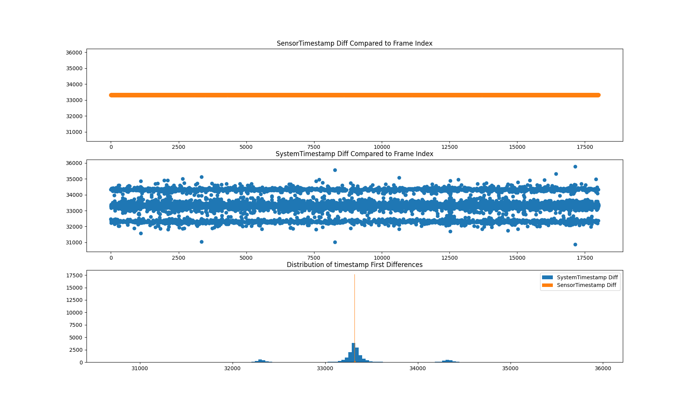
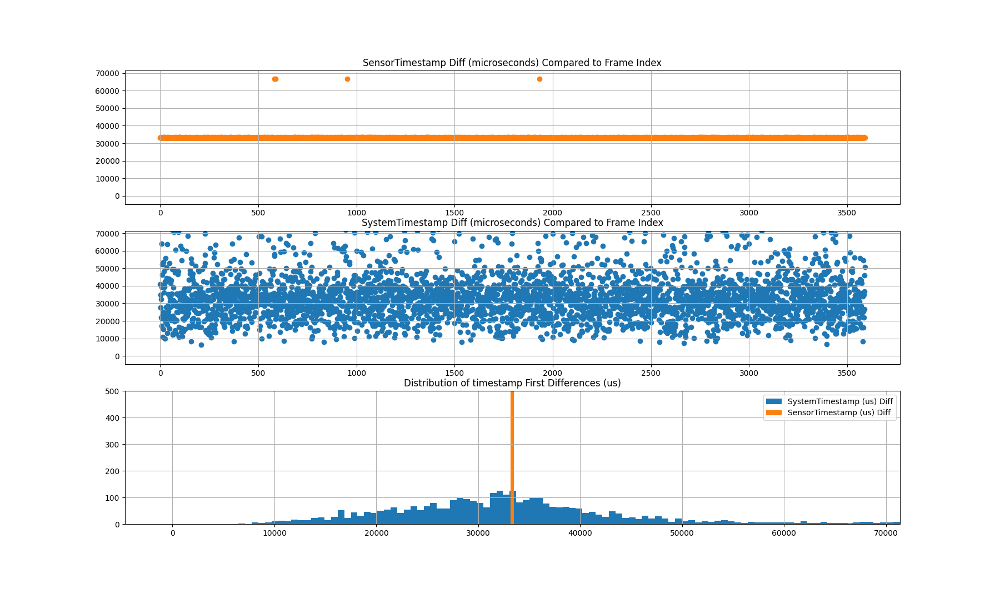

# IMX708 Camera Module 3 from Arducam

I modified https://github.com/raspberrypi/picamera2/blob/main/picamera2/encoders/encoder.py#L334

To print ts and time.time() * 1e6 (to convert to micro seconds)

### Exp 1: collecting an MP4 on a quiet system:

from 10_min_timestamp.csv

```
┌────────────┬───────────┬───────────┬───────────────────────┬───────────────────────┐
│ statistic  ┆ sensor_ts ┆ system_ts ┆ sensor_timestamp_diff ┆ system_timestamp_diff │
│ ---        ┆ ---       ┆ ---       ┆ ---                   ┆ ---                   │
│ str        ┆ f64       ┆ f64       ┆ f64                   ┆ f64                   │
╞════════════╪═══════════╪═══════════╪═══════════════════════╪═══════════════════════╡
│ count      ┆ 18001.0   ┆ 18001.0   ┆ 18000.0               ┆ 18000.0               │
│ null_count ┆ 0.0       ┆ 0.0       ┆ 1.0                   ┆ 1.0                   │
│ mean       ┆ 4.6818e9  ┆ 1.7542e15 ┆ 33318.251722          ┆ 33318.262222          │
│ std        ┆ 1.7314e8  ┆ 1.7314e8  ┆ 1.473858              ┆ 724.463407            │
│ min        ┆ 4.3819e9  ┆ 1.7542e15 ┆ 33308.0               ┆ 7780.0                │
│ 25%        ┆ 4.5319e9  ┆ 1.7542e15 ┆ 33317.0               ┆ 33260.25              │
│ 50%        ┆ 4.6818e9  ┆ 1.7542e15 ┆ 33318.0               ┆ 33317.0               │
│ 75%        ┆ 4.8317e9  ┆ 1.7542e15 ┆ 33319.0               ┆ 33374.25              │
│ max        ┆ 4.9817e9  ┆ 1.7542e15 ┆ 33329.0               ┆ 94415.0               │
└────────────┴───────────┴───────────┴───────────────────────┴───────────────────────┘
```



The standard deviation of the sensor timestamp appears to be very small compared
to the system timestamps.


### Exp 2: collecting an MP4 while inducing high CPU load:

```zsh
# While collecting an MP4 also run stress in another terminal.
stress --cpu 8 --io 4 --vm 4 --vm-bytes 1024M --timeout 360s
```

```
┌────────────┬──────────────┬──────────────┬──────────────────────────┬──────────────────────────┐
│ statistic  ┆ sensor_ts_us ┆ system_ts_us ┆ sensor_timestamp_diff_us ┆ system_timestamp_diff_us │
│ ---        ┆ ---          ┆ ---          ┆ ---                      ┆ ---                      │
│ str        ┆ f64          ┆ f64          ┆ f64                      ┆ f64                      │
╞════════════╪══════════════╪══════════════╪══════════════════════════╪══════════════════════════╡
│ count      ┆ 3592.0       ┆ 3592.0       ┆ 3591.0                   ┆ 3591.0                   │
│ null_count ┆ 0.0          ┆ 0.0          ┆ 1.0                      ┆ 1.0                      │
│ mean       ┆ 3.0646e8     ┆ 1.7543e15    ┆ 33355.010304             ┆ 33361.044834             │
│ std        ┆ 3.4594e7     ┆ 3.4594e7     ┆ 1111.588136              ┆ 12675.434736             │
│ min        ┆ 2.4654339e8  ┆ 1.7543e15    ┆ 33149.0                  ┆ 6469.25                  │
│ 25%        ┆ 2.76529528e8 ┆ 1.7543e15    ┆ 33304.0                  ┆ 25366.0                  │
│ 50%        ┆ 3.06482209e8 ┆ 1.7543e15    ┆ 33318.0                  ┆ 32180.25                 │
│ 75%        ┆ 3.3640172e8  ┆ 1.7543e15    ┆ 33333.0                  ┆ 38693.75                 │
│ max        ┆ 3.66321232e8 ┆ 1.7543e15    ┆ 66640.0                  ┆ 102457.75                │
└────────────┴──────────────┴──────────────┴──────────────────────────┴──────────────────────────┘
```



